<div align="center">

# CardioLens-IoT

**Explainable 12-lead ECG image classification for IoT-based cardiac monitoring**

[](https://www.python.org/)
[](https://www.tensorflow.org/)
[](https://fastapi.tiangolo.com/)
[](LICENSE)
[](#citation)

</div>

CardioLens-IoT is an end-to-end cardiac monitoring system. ECG data travel from patient-side sensors through an energy-aware IoT network to a cloud service, where a fine-tuned **EfficientNetB0** classifies the 12-lead ECG image, explains its decision with **Grad-CAM**, and raises an alert when a critical condition such as **myocardial infarction** is detected.

<p align="center">
  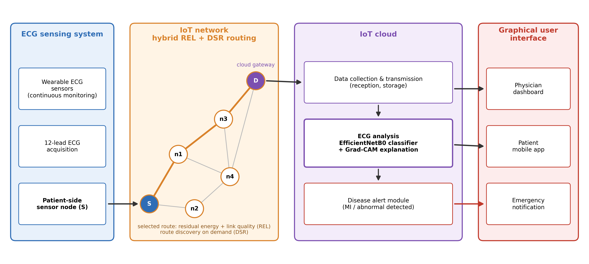
</p>

## Highlights

- **93.57% test accuracy, 0.994 macro AUC and 100% recall for myocardial infarction** on held-out original images (4 classes, 140 test images).
- **Leak-free evaluation:** the data are split *before* augmentation, and only the training set is augmented. A controlled experiment shows that the common alternative, augmenting first, inflates accuracy of the same model to 98.74%.
- **Explainable predictions:** every alert can carry a Grad-CAM heatmap, and the heatmaps focus on the ECG waveforms rather than text or margins.
- **Complete IoT reference implementation:** a cloud API (collection, analysis and alert modules), an edge-gateway client, and a hybrid REL + DSR routing simulator.
- **Lightweight model:** about 4.05 million parameters, suited to cloud or edge deployment.

---

## Contents

- [System architecture](#system-architecture)
- [ECG analysis pipeline](#ecg-analysis-pipeline)
- [Results](#results)
- [What makes CardioLens-IoT different](#what-makes-cardiolens-iot-different)
- [Repository structure](#repository-structure)
- [Getting started](#getting-started)
---

## System architecture

The system has four layers:

| Layer | Role | Implementation in this repository |
|---|---|---|
| **ECG sensing** | Wearable sensors and 12-lead ECG devices record the ECG; the patient-side node is the source of the data. | Input ECG images |
| **IoT network** | ECG data travel over a multi-hop sensor network to the cloud gateway using **hybrid REL + DSR routing**. | [`iot/network/hybrid_routing.py`](iot/network/hybrid_routing.py) |
| **IoT cloud** | Three modules: data collection & storage, ECG analysis (EfficientNetB0 + Grad-CAM), disease alert. | [`iot/cloud/api.py`](iot/cloud/api.py) |
| **User interface** | Physician dashboard, patient app and emergency notifications consume the cloud results. | `/records` endpoint and alert webhook |

The edge gateway ([`iot/edge/gateway_client.py`](iot/edge/gateway_client.py)) resizes and compresses each ECG image before upload, which reduces bandwidth on low-power links.

### Hybrid routing

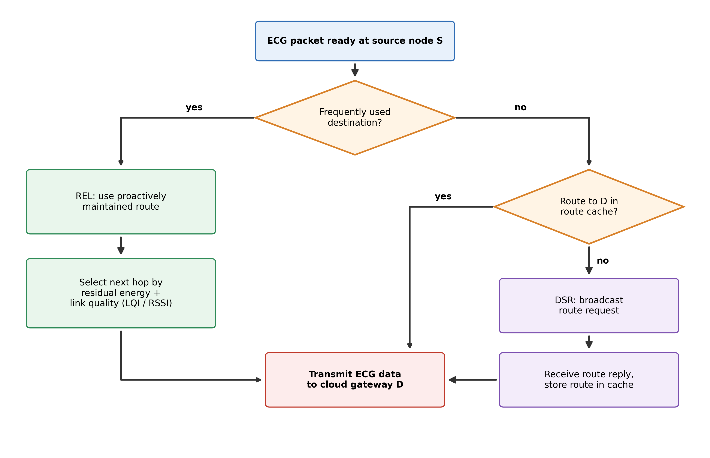

- **REL (routing by energy and link quality)** keeps proactive routes to frequently used destinations such as the cloud gateway, choosing each next hop by link quality (LQI/RSSI) and residual battery energy.
- **DSR (dynamic source routing)** discovers routes on demand for infrequent destinations and caches them.
- **Hybrid** uses REL for the main data path and DSR elsewhere: low latency where most traffic flows, low maintenance overhead everywhere else.

Example output of the included simulator (80 nodes, 10,000 packets, 90% to the gateway, seed 11). These are illustrative results from a simplified radio and energy model, not hardware measurements:

| Policy | Delivery (%) | Control messages | Energy used (J) |
|---|---|---|---|
| DSR only | 90.2 | 71,692 | 7.94 |
| REL only | 94.3 | 320,000 | 12.38 |
| **Hybrid** | **93.9** | **45,738** | **6.97** |

<br clear="right">

---

## ECG analysis pipeline

<p align="center">
  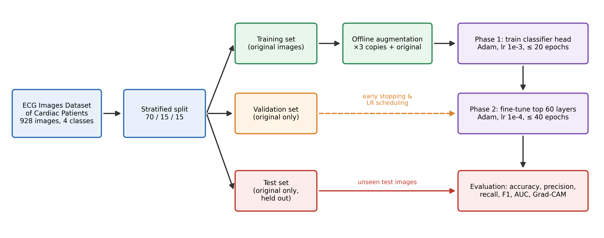
</p>

1. **Data:** [ECG Images Dataset of Cardiac Patients](https://doi.org/10.17632/gwbz3fsgp8.2), 928 12-lead ECG images in four classes: abnormal heartbeat (233), history of MI (172), myocardial infarction (239) and normal (284).
2. **Leak-free split:** stratified 70 / 15 / 15 split of the *original* images into training (649), validation (139) and test (140) sets.
3. **Augmentation of the training set only:** three copies per image (translation, zoom, rotation, contrast) with white fill to match ECG paper, giving 2,596 training images.
4. **Model:** EfficientNetB0 pretrained on ImageNet, 384 × 384 RGB input, global average pooling, dropout 0.3, four-class softmax.
5. **Two-phase training:** head only (backbone frozen), then fine-tuning of the top 60 layers with batch normalization kept frozen. Balanced class weights, early stopping on validation loss, learning-rate scheduling.
6. **Evaluation:** a single pass over the held-out test set, with per-class metrics, AUC, Cohen's kappa and Grad-CAM.

<p align="center">
  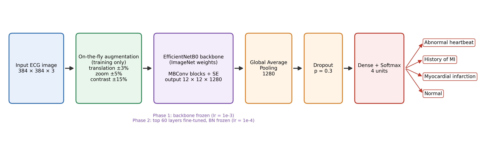
</p>

---

## Results

### Overall test performance (140 held-out original images)

| Metric | Value |
|---|---|
| Accuracy | **93.57%** (95% CI: 88.2–96.6%) |
| Macro F1-score | 0.932 |
| Macro AUC (one-vs-rest) | **0.994** |
| Cohen's kappa | 0.914 |
| Parameters | 4.05 M |

### Per class

| Class | Precision | Recall | Specificity | F1-score | Test images |
|---|---|---|---|---|---|
| Abnormal heartbeat | 0.919 | 0.971 | 0.971 | 0.944 | 35 |
| History of MI | 0.885 | 0.885 | 0.974 | 0.885 | 26 |
| **Myocardial infarction** | 0.947 | **1.000** | 0.981 | 0.973 | 36 |
| Normal | 0.974 | 0.884 | 0.990 | 0.927 | 43 |

All 36 myocardial infarction cases were detected. The model's errors lean towards flagging normal ECGs as abnormal rather than the reverse, which is the safer direction for a screening system.

<p align="center">
  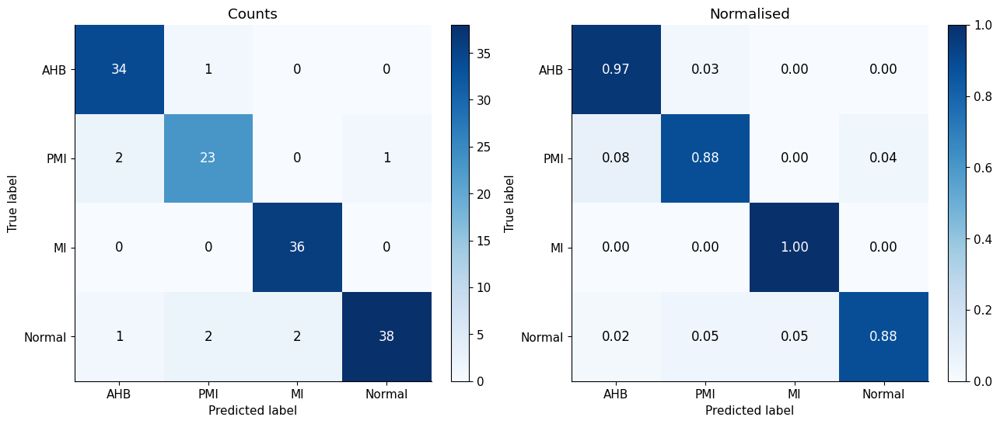
  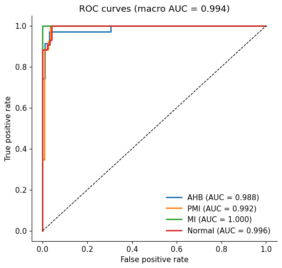
</p>

### Explainability

Grad-CAM heatmaps concentrate on the ECG waveforms, mainly the precordial leads, and not on the report header, patient text or margins.

<p align="center">
  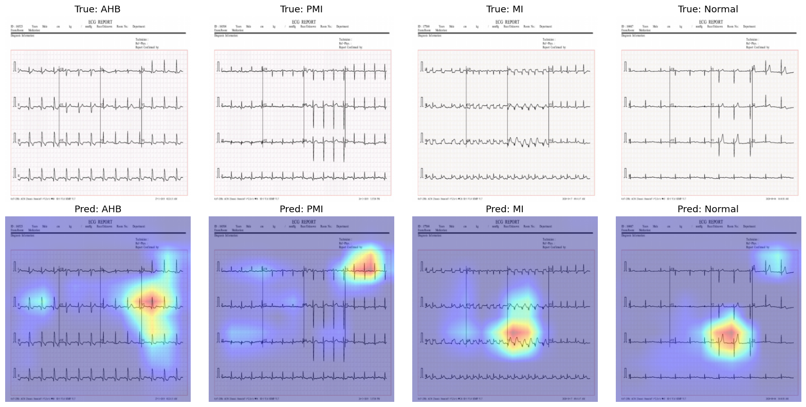
</p>

<details>
<summary><b>More figures</b> (training curves, t-SNE, samples, augmentation)</summary>

<p align="center">
  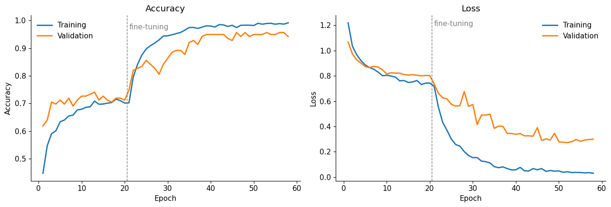<br>
  <em>Training and validation curves; the dashed line marks the start of fine-tuning.</em>
</p>
<p align="center">
  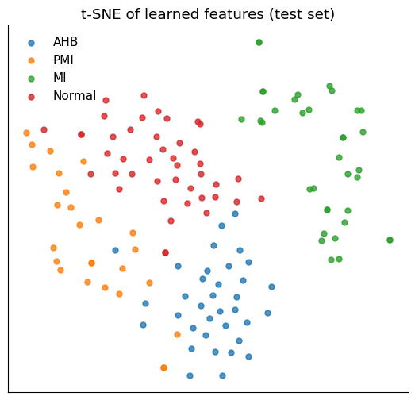
  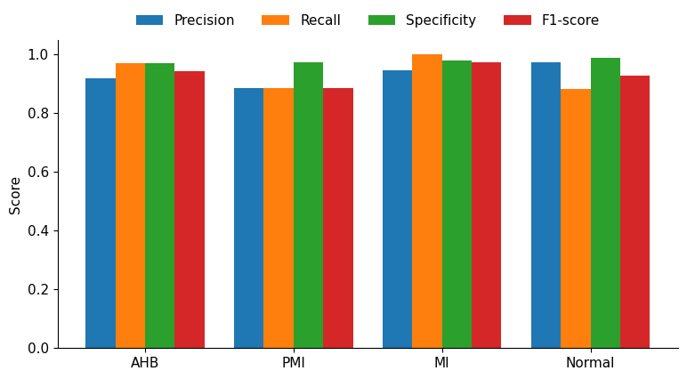
</p>
<p align="center">
  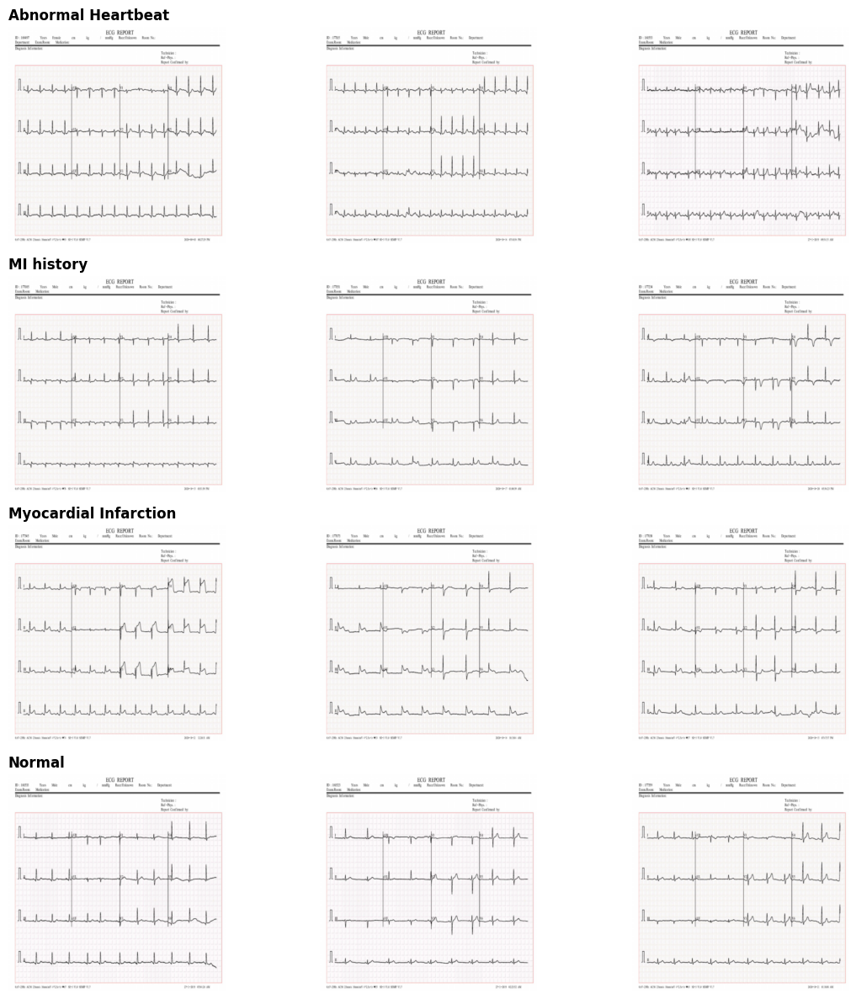<br>
  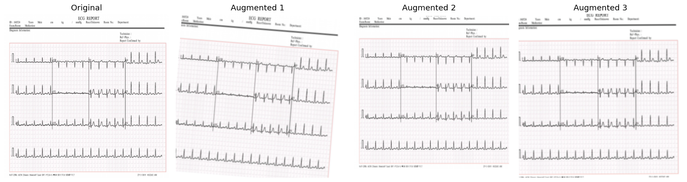
</p>

</details>

---

## What makes CardioLens-IoT different

### 1. It measures generalization, not memorization

In many ECG-image pipelines, images are augmented before the train/test split. Each ECG then exists in several slightly shifted or zoomed versions that land on both sides of the split, so about 97% of test images have a near-copy in the training data. We ran the **same model, code and seed** under both orders:

| Processing order | Test set content | Test accuracy |
|---|---|---|
| Augment, then split | Originals and augmented copies | 98.74% |
| **Split, then augment (CardioLens-IoT)** | **Original, unseen images only** | **93.57%** |

The 5-point gap comes from the processing order alone. Accuracies reported on this dataset are therefore only comparable when the evaluation protocol is the same.

### 2. Comparison with existing work on the same dataset

Reported results on the ECG Images Dataset of Cardiac Patients:

| Work | Method | Evaluation | Accuracy |
|---|---|---|---|
| Khan et al., 2021 | MobileNet v2 | Train/test split | 97.50% |
| Abubaker & Babayiğit, 2023 | CNN | Train/test split | 98.23% |
| Sadad et al., 2023 | Lightweight CNN + attention, IoT framework | 80/20 split | 98.39% |
| **CardioLens-IoT** | Fine-tuned EfficientNetB0, IoT framework | 70/15/15 split, training-only augmentation | 93.57% |

Compared with the closest prior system (Sadad et al., 2023), which also combines ECG image classification with an IoT framework:

| Aspect | Sadad et al., 2023 | CardioLens-IoT |
|---|---|---|
| Backbone | 4-layer CNN + attention, trained from scratch | EfficientNetB0 pretrained on ImageNet, two-phase fine-tuning |
| Input | 288 × 432, single channel | 384 × 384, RGB |
| Data split | 80% train / 20% test | 70% train / 15% validation / 15% test |
| Model selection | Not reported | Early stopping on a separate validation set |
| Augmentation | Not reported | Training set only, after the split |
| Class imbalance | Not addressed | Balanced class weights |
| Metrics | Accuracy, precision, recall, confusion matrix | Adds specificity, F1, AUC, Cohen's kappa, confidence interval |
| Explainability | None | Grad-CAM and t-SNE |
| Dataset audit | Not reported | Exact-duplicate check (MD5) |
| IoT layer | Framework design | Design plus runnable cloud API, edge client and routing simulator |

The lightweight CNN of Sadad et al. needs far fewer operations, which suits very constrained devices. CardioLens-IoT runs its larger model in the IoT cloud, where that cost is small.

### 3. It is a system, not only a model

The classifier is wrapped in working IoT components: an HTTP cloud service that stores every analysis, returns explanations and raises graded alerts (critical for MI, warning for other abnormalities), an edge client that compresses images before upload, and a routing simulator for the sensor network.

---

## Repository structure

```
cardiolens-iot/
├── README.md
├── LICENSE
├── CITATION.cff
├── requirements.txt
├── notebooks/
│   ├── cardiolens_training.ipynb     # full training & evaluation pipeline (with outputs)
│   └── benchmark_experiments.ipynb   # baselines, repeated seeds, de-duplicated data
├── cardiolens/                       # Python package: inference + Grad-CAM
│   ├── config.py                     #   class names, image size, alert levels
│   └── inference.py                  #   ECGClassifier, command-line inference
├── iot/
│   ├── README.md                     # how the IoT layer fits together
│   ├── cloud/api.py                  # IoT cloud: collection, analysis, alert (FastAPI)
│   ├── edge/gateway_client.py        # edge gateway: pre-process and upload ECG images
│   └── network/hybrid_routing.py     # REL + DSR hybrid routing simulator
├── models/README.md                  # where to put the trained model
├── data/README.md                    # how to get the dataset
├── results/results.json              # all metrics from the training notebook
└── docs/figures/                     # figures used in this README and the paper
```

---

## Getting started

### 1. Install

```bash
git clone https://github.com/<your-username>/cardiolens-iot.git
cd cardiolens-iot
python -m venv .venv && source .venv/bin/activate      # Windows: .venv\Scripts\activate
pip install -r requirements.txt
```

### 2. Train (Kaggle, recommended)

1. Create a Kaggle notebook, import `notebooks/cardiolens_training.ipynb`, and add the [ECG Images Dataset of Cardiac Patients](https://doi.org/10.17632/gwbz3fsgp8.2) as input.
2. Enable a GPU (T4 x2) and run all cells (about 20 minutes).
3. Download `ecg_efficientnetb0.keras` from the output and place it in `models/`.

To train locally instead, put the dataset folders in `data/raw/` (see [`data/README.md`](data/README.md)). The notebook detects the environment automatically.

### 3. Classify an ECG image

```bash
python -m cardiolens.inference path/to/ecg.jpg --gradcam gradcam.png
```

### 4. Run the IoT cloud and send an ECG from the edge

```bash
# terminal 1: cloud service
uvicorn iot.cloud.api:app --host 0.0.0.0 --port 8000

# terminal 2: edge gateway
python iot/edge/gateway_client.py --image path/to/ecg.jpg --patient-id P001 --explain
```

Interactive API documentation is available at `http://localhost:8000/docs`.

### 5. Simulate the sensor network

```bash
python iot/network/hybrid_routing.py --nodes 80 --area 140 --packets 10000 --seed 11
```

See [`iot/README.md`](iot/README.md) for details on each IoT component.

---

## License

Code is released under the [MIT License](LICENSE). The dataset is **not** included in this repository and is subject to its own license on Mendeley Data.

## Author

**Amira Awadallah**, Department of Computer Engineering, The French University in Cairo, Egypt
 amira.ayman@ufe.edu.eg

## Acknowledgments

- A. H. Khan and M. Hussain for the ECG Images Dataset of Cardiac Patients.
- T. Sadad et al. (2023) for the IoT cardiac monitoring framework that this work builds on.
- EfficientNet (Tan & Le, 2019) and Grad-CAM (Selvaraju et al., 2017).

> **Disclaimer:** CardioLens-IoT is a research project. It is not a medical device and must not be used for clinical diagnosis.
